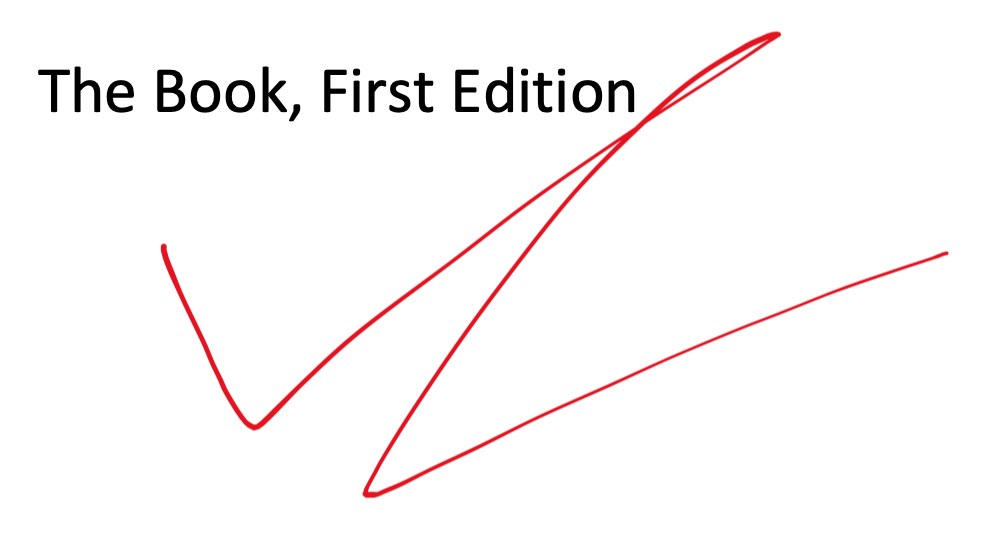

= Book As Code
Author One, Author Two, Author Three, Author Four
// Be careful of blank lines!!!
//#### BEGIN DOCUMENT HEADER #########################################
// No blank lines are allowed in the document header
// Doing so will cause document attributes to not be evaluated.
//####################################################################
:doctype: book
:docinfo:
// Enables Figure Numbers in <<references>>
:xrefstyle: full
:sectnums:
:pagenums:
:toc:
:toclevels: 4
ifeval::["{doctype}" == "book"]
:front-cover-image: 
endif::[]
// Default to using SVG
:graphviz-format: svg
:ditaa-format: svg
:plantuml-format: svg
// Some formats can only use PNG
ifeval::["{backend}" == "docbook5"]
:graphviz-format: png
:ditaa-format: png
:plantuml-format: png
endif::[]
ifeval::["{backend}" == "epub3"]
:graphviz-format: png
:ditaa-format: png
:plantuml-format: png
endif::[]
// Image Sizing Helpers
ifdef::backend-html5[]
:twoinches: width='144'
:full-width: width='100%'
:80p-width: width='80%'
:66p-width: width='66%'
:50p-width: width='50%'
:25p-width: width='25%'
:thumbnail: width='60'
endif::[]
ifdef::backend-pdf[]
:twoinches: pdfwidth='2in'
:full-width: pdfwidth='100%'
:80p-width: pdfwidth='80%'
:66p-width: pdfwidth='66%'
:50p-width: pdfwidth='50%'
:25p-width: pdfwidth='25%'
:thumbnail: pdfwidth='20mm'
endif::[]
ifdef::backend-docbook5[]
:twoinches: width='50mm'
:full-width: scaledwidth='100%'
:80p-width: scaledwidth='80%'
:66p-width: scaledwidth='66%'
:50p-width: scaledwidth='50%'
:25p-width: scaledwidth='25%'
:thumbnail: width='20mm'
endif::[]
:source-highlighter: highlightjs
// Math Formula Helpers
:stem: latexmath
:imagesoutdir: build
//#### END DOCUMENT HEADER ###########################################

[preface]
== Notices

[IMPORTANT]
====
Changes to this document must be made via github pull request:

* https://github.com/dcwangmit01/book-as-code

A better-formatted PDF document may be downloaded from:

* https://github.com/dcwangmit01/book-as-code/blob/master/build/book-as-code.pdf
====

include::book/book.adoc[]
